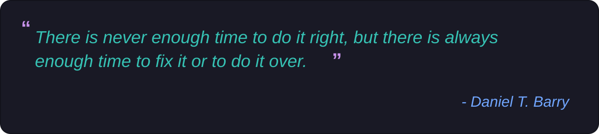

  

  

### 🚀 About Me

Web developer who enjoys clean code, creative problem-solving, and building things from scratch. Outside of coding, I’m usually learning a new language, exploring a new idea, or starting another project.

🔭 &nbsp;I'm currently working on **a project that worked perfectly yesterday**  
🌱 &nbsp;I'm currently learning **how to turn "I know some JavaScript" into "I know too much JavaScript"**  
👯 &nbsp;I'm looking to collaborate on **anything that makes developers suffer slightly less**  
💬 &nbsp;Ask me about **React, Node.js, APIs, and things I probably Googled**  
⚡ &nbsp;Fun fact: **I can spend 3 hours debugging and discover I misspelled one variable**

### 🛠️ Tech Stack

  
  
  
  
  
  
  
  
  
  
  
  
  
  
  
  
  
  
  
  

### 🔗 Connect With Me

  
  
  

### 📊 GitHub Stats

  
  

### 📈 Contribution Graph

  

### 💭 Dev Quote

  

---

<i>⭐️ From <a href="https://github.com/Milana041516">Milana041516</a></i>

